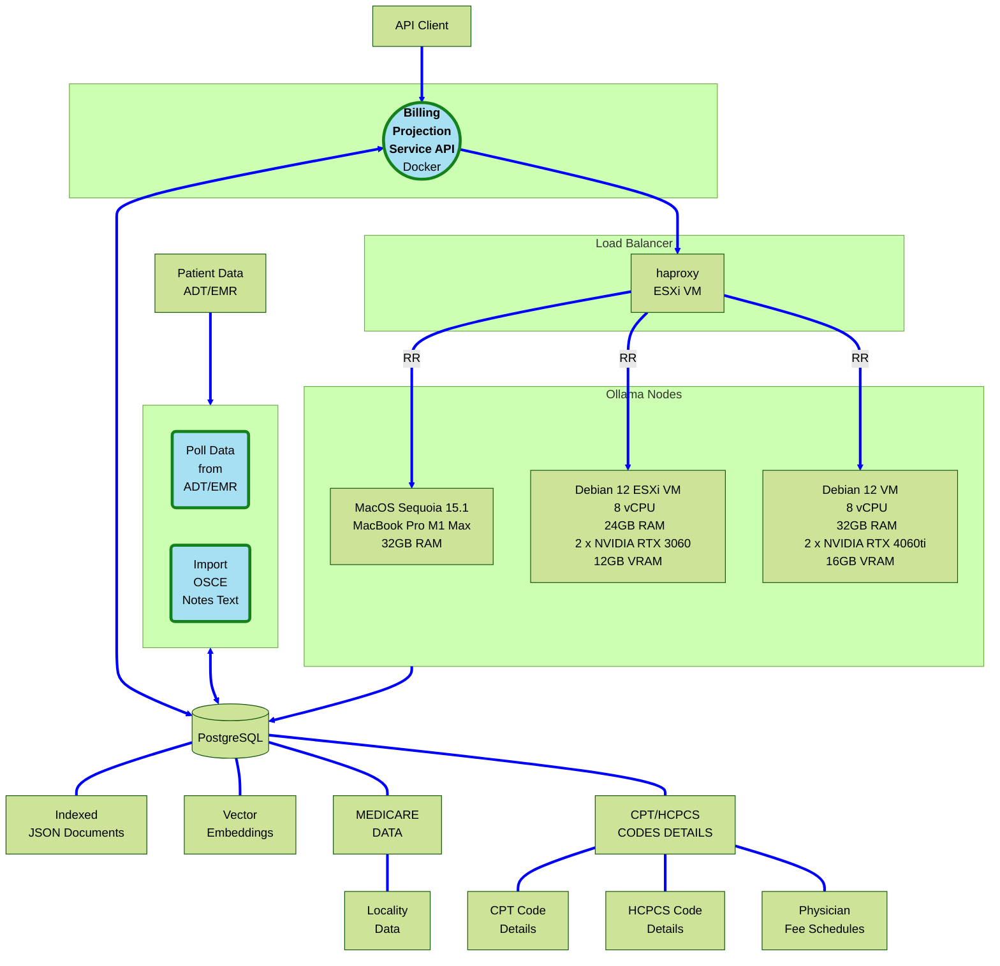
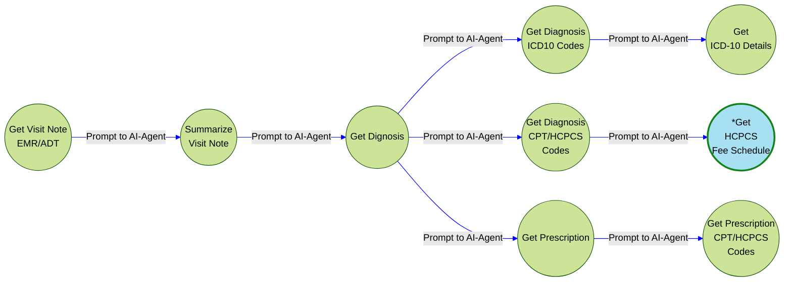
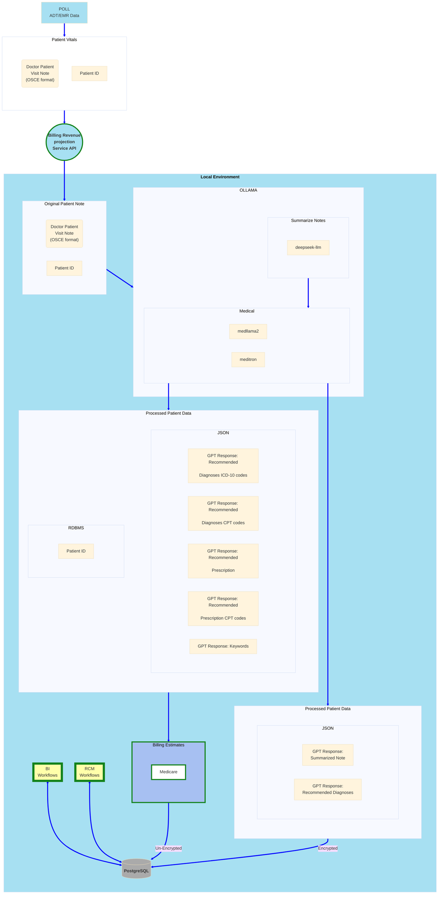
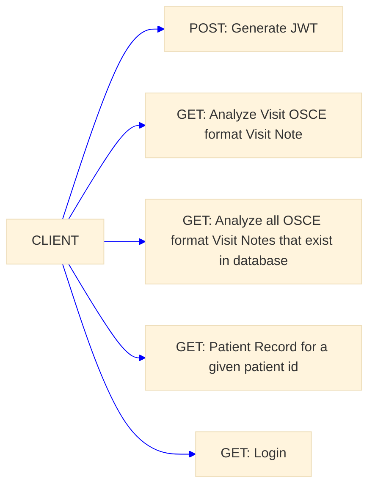
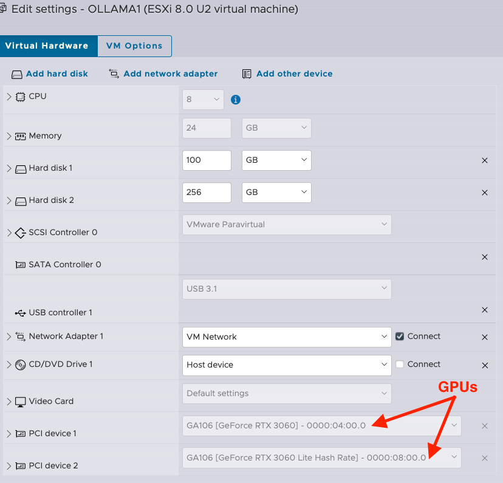
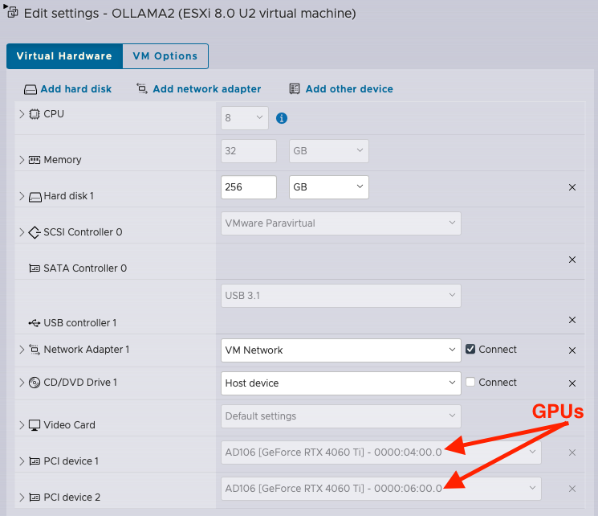

## Medical Billing Forecasting using LLMs


https://github.com/user-attachments/assets/0d374544-b74c-4286-8a65-3d5ee6f61656


### General Overview
This setup aims to provide near-real-time AgenticAI assistance. Agents commence the process of generating guesses immediately after a patient doctor visit concludes, before a care provider has started entering summaries, diagnoses, and ICD codes. This initiative is intended to eliminate the need for manual collation tasks at the end of each day, shift, or month. Real-time access to the billing forecast and the actual amount billed up to that point is provided to back-office staff.

In this scenario, agents swiftly take the visit note, often even faster, and proceed to a simulation of note summarization and diagnosis. Subsequently, they provide prescriptions and lab work recommendations based on the diagnosis, while simultaneously checking the fee schedule based on the medical insurance coverage, which may include a single provider or a combination of (Medicare, Medical, etc.). As the care provider walks through the actual workflow, agents learn, correct, or update their initial guesses. This process repeats itself.



### Ollama-GPT graph


### Detailed Overview


#### Sample Data

**Sample HL7 string for a medicare patient**
```shell
MSH|^~\&|SENDING_APPLICATION|SENDING_FACILITY|RECEIVING_APPLICATION|RECEIVING_FACILITY|20240315120000||ADT^A04|123456789|P|2.3|
EVN|A04|20240315091000||
PID|1||123456789||Doe^John^^^Mr.||19600515|M|||123 Main St^^Anytown^NY^12345||555-555-5555|||S|||00000|||123-45-6789|
PV1|1|O|^^^BED^Room|||||||1000^Attending Doctor^Doctor^^Dr.^^^12345678|||||||||||||||||||||||||20240315120000|
DG1|1|ICD|I21.3|ST elevation (STEMI) myocardial infarction of unspecified site|||
DG1|2|ICD|I25.2|Old myocardial infarction|||
DG1|3|CPT|99223|Initial hospital care, typically 70 minutes|||
DG1|4|CPT|93010|Electrocardiogram, routine ECG with at least 12 leads|||
DG1|5|CPT|93000|Electrocardiogram, routine ECG with at least 12 leads; interpretation and report only|||
ZCL|1|MAC|ABCDE|Medicare Administrative Contractor|
ZCL|2|LOC|01|Locality Code|
```

**Sample condensced Visit Note OSCE format**
```shell
D: How may I help you?

P: Hi, yes I've had this pain in my left elbow for a couple of weeks now and it's not 
getting any better so. I'm just here to kind of figure out what it is. 

D: OK alright are you feeling this pain on the lateral side of the elbow, on the or on 
the medial side of the elbow?

P: It's on the medial side. 

D: OK and sorry, when did this pain exactly start?

P: So it's been on going for like the past three months. But it's gotten worse over 
the last, I'd say three weeks. 

D: OK, and. Has the pain been getting worse, any better?

P: Oh the pains been getting worse.
```

**OSCE Visit Note Summarized(deepseek-llm)**:
```shell
The patient has presented with symptoms of fever, headache, fatigue, brain fog, and muscle aches.
The doctor suspects a viral infection, specifically COVID-19, influenza, or a common cold. They 
have ordered PCR COVID-19 swab as well as general lab work to further investigate the cause of the 
patient's symptoms. The doctor also mentions the possibility of meningitis and will investigate 
this further by potentially ordering a lumbar puncture or blood work if needed.
```

**RECOMMENDED DIAGNOSIS (medllama2)**:
```shell
This patient has a high risk of developing severe COVID-19 due to their age and underlying health
conditions. They should be isolated immediately, and we should contact the local public health
agency for further guidance. We need to ensure that they have access to appropriate medical care 
and support.
```


#### API Overview



**From ADT Feeds and/or EMR**: 
 * Captures medical conversations in Objective Structured Clinical Examinations (OSCE) format.
 * Condenses the medical conversation into a concise prompt.
 * Utilizes medllama LLMs to analyze the condensed conversation.
   - Converts the summarized note into a diagnosis and treatment plan.
   - Derives a prescription note based on the diagnosis and treatment plan.
   - Extracts ICD-10 codes from the diagnosis.
   - Adds details of ICD-10 codes by performing a lookup.
   - Extracts CPT codes from both diagnosis and prescription notes.
   - Retrieves details of CPT codes, such as description and billability.
   - Identifies keywords from the diagnosis and treatment plan.
   - Stores all information as various JSON documents in PostgreSQL.
 * Encrypts the analyzed text and incorporates it into a searchable JSON document in PostgreSQL.
  
**Deployed as WSGI**  
*  Uses Gunicorn WSGI

#### How-to Run
* Install Python Modules:
    > pip3 install -r requirements.txt

* Gen SSL key/cert for secure connection to the service
    > openssl req -x509 -newkey rsa:4096 -nodes -out cert.pem -keyout key.pem -days 3650

* Gen Symmetric encryption key for encrypting any text
   > ./tools/generate_keys.py
   > Encrption Key File text_encryption.key created

* Create Database and tables:
    See **zollama.sql**

### Install Ollama-gpt 

#### Linux
* https://github.com/ollama/ollama/blob/main/docs/linux.md

* Sample Debian Service config file: /etc/systemd/system/ollama.service
Add **OLLAMA_HOST** environment variable to allow remote access
```shell
[Service]
Environment="OLLAMA_HOST=0.0.0.0"
..
..
..

```

#### MacOS
* I installed Ollama-gpt on my MacMini M1 - using brew
```shell
> brew install ollama
```
* Start/Stop Service
```shell
> brew services start ollama
> brew services stop ollama
```

**Bind Ollama server to local IPV4 address**

* create a run shell script
  ```shell
  > /opt/homebrew/opt/ollama/bin
  ```
* Create a script named **ollama.sh** add the following
  ```shell
  #!/usr/bin/env bash
  export OLLAMA_HOST=0.0.0.0
  /opt/homebrew/bin/ollama $1
  ```
* Make script "executable"
  ```shell
  chmod +x ollama.sh
  ```
* Edit .plist file for the ollama homebrew service
  ```shell
    > cd /opt/homebrew/Cellar/ollama
    > cd 0.1.24 #this may be different for your system
    > vi homebrew.mxcl.ollama.plist
  ```
* Change original line
  > <string>/opt/homebrew/opt/ollama/bin/ollama</string>

    TO this:
  > <string>/opt/homebrew/opt/ollama/bin/ollama.sh</string>
* Save file
* stop/start service
  ```shell
  > brew services stop ollama && brew services start ollama
  ```
* Add following models to ollama-gpt: deepseek-llm,llama2,llama-pro 
  ```shell
  > for llm in deepseek-llm llama2 llama-pro gemma
    do
        ollama pull ${llm}
    done
  ```
* Update setup.config with pertinent information (see setup.config.template)
  ```text
     # update with required information and save it as
     #	setup.config file
    [psqldb]
    host=
    port=5432
    database=
    user=
    password=

    [service]
    SRVC_NAME=
    JWT_SECRET_KEY=
    SRVC_SHARED_SECRET=
    IDENTITY=
    APP_SECRET_KEY=
    ENDPOINT_URL=
    OLLAMA_API_URL=
    LLMS=
    MEDLLMS=
    ENCRYPTION_KEY=
  ```

* Run Zollama-GPT Service:
    (see https://docs.gunicorn.org/en/stable/settings.html for config details)
```shell
    > gunicorn --certfile=cert.pem \
               --keyfile=key.pem \
               --bind 0.0.0.0:5000 \
               zollama:app \
               --timeout 2592000 \
               --threads 4 \
               --reload
```

**Seed the DB with Anonymized Read World OSCE Notes**
> ./seed_data.py
 
**Script Output**
```shell
MedData/Clean Transcripts/RES0181.txt
MedData/Clean Transcripts/RES0195.txt
MedData/Clean Transcripts/GAS0001.txt
```
* Customize it to your hearts content!

* **LICENSE**: The 3-Clause BSD License - license.txt

* **TODO**:
    - Add Swagger Docs
    - Add long running task queue
        - Queue: task_id, task_status, end_point
    - Revisit Endpoint logic add robust error handling
    - Add logic to handle list of lists with NUM_ELEMENTS_CHUNK elements
        - retry after 429
        - break down longer list of items into list of lists with small
            chunks

#### How-to use the API examples
* These examples assume that environment variable **API_KEY** is using a valid API_KEY


**Chat Prompt a given visit note id**
```shell
> export api_key=<api_key>
>
> export AT=$(curl -sk -X POST -H "Content-Type: application/json" -d '{"api_key":"'${foo}'"}' \
https://127.0.0.1:5001/login | jq -r .access_token) \
&& curl -sk -X GET -H "Authorization: Bearer ${AT}" 'https://127.0.0.1:5001/analyze_visit_note?visit_note_id=<visit note id>'
```

**Chat Prompt ALL patient visit notes that are currently stored in  database**
```shell
> export api_key=<api_key>
>
> export AT=$(curl -sk -X POST -H "Content-Type: application/json" -d '{"api_key":"'${foo}'"}' \
https://127.0.0.1:5001/login | jq -r .access_token) \
&& curl -sk -X GET -H "Authorization: Bearer ${AT}" 'https://127.0.0.1:5001/analyze_visit_notes'
```


#### Database Schema


#### Ollama-gpt VM config 

**2 x RTX 3060 12GB VRAM each in Passthrough Mode**



**2 x RTX 4060ti 16GB VRAM each in Passthrough Mode**




#### PostgreSQL VM config

