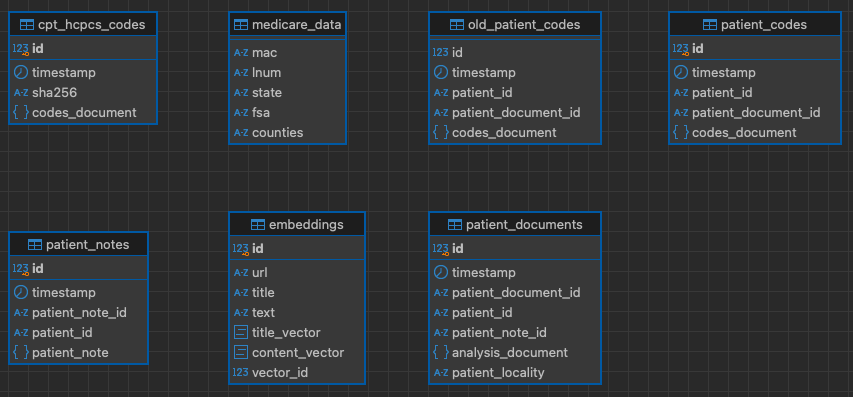

## ZOLLAMA-GPT

### General Overview


#### API Overview


**From ADT Feeds and/or EMR**: 
 * Captures medical conversations in Objective Structured Clinical Examinations (OSCE) format.
 * Condenses the medical conversation into a concise prompt.
 * Utilizes medllama LLMs to analyze the condensed conversation.
   - Converts the summarized note into a diagnosis and treatment plan.
   - Derives a prescription note based on the diagnosis and treatment plan.
   - Extracts ICD-10 codes from the diagnosis.
   - Adds details of ICD-10 codes by performing a lookup.
   - Extracts CPT codes from both diagnosis and prescription notes.
   - Retrieves details of CPT codes, such as description and billability.
   - Identifies keywords from the diagnosis and treatment plan.
   - Stores all information as various JSON documents in PostgreSQL.
 * Encrypts the analyzed text and incorporates it into a searchable JSON document in PostgreSQL.
  
**Deployed as WSGI**  
*  Uses Gunicorn WSGI

#### How-to Run
* Install Python Modules:
    > pip3 install -r requirements.txt

* Gen SSL key/cert for secure connection to the service
    > openssl req -x509 -newkey rsa:4096 -nodes -out cert.pem -keyout key.pem -days 3650

* Gen Symmetric encryption key for encrypting any text
   > ./tools/generate_keys.py
   > Encrption Key File text_encryption.key created

* Create Database and tables:
    See **zollama.sql**

### Install Ollama-gpt 

#### Linux
* https://github.com/ollama/ollama/blob/main/docs/linux.md

* Sample Debian Service config file: /etc/systemd/system/ollama.service
Add **OLLAMA_HOST** environment variable to allow remote access
```shell
[Service]
Environment="OLLAMA_HOST=0.0.0.0"
..
..
..

```

#### MacOS
* I installed Ollama-gpt on my MacMini M1 - using brew
```shell
> brew install ollama
```
* Start/Stop Service
```shell
> brew services start ollama
> brew services stop ollama
```

**Bind Ollama server to local IPV4 address**

* create a run shell script
  ```shell
  > /opt/homebrew/opt/ollama/bin
  ```
* Create a script named **ollama.sh** add the following
  ```shell
  #!/usr/bin/env bash
  export OLLAMA_HOST=0.0.0.0
  /opt/homebrew/bin/ollama $1
  ```
* Make script "executable"
  ```shell
  chmod +x ollama.sh
  ```
* Edit .plist file for the ollama homebrew service
  ```shell
    > cd /opt/homebrew/Cellar/ollama
    > cd 0.1.24 #this may be different for your system
    > vi homebrew.mxcl.ollama.plist
  ```
* Change original line
  > <string>/opt/homebrew/opt/ollama/bin/ollama</string>

    TO this:
  > <string>/opt/homebrew/opt/ollama/bin/ollama.sh</string>
* Save file
* stop/start service
  ```shell
  > brew services stop ollama && brew services start ollama
  ```
* Add following models to ollama-gpt: deepseek-llm,llama2,llama-pro 
  ```shell
  > for llm in deepseek-llm llama2 llama-pro gemma
    do
        ollama pull ${llm}
    done
  ```
* Update setup.config with pertinent information (see setup.config.template)
  ```text
     # update with required information and save it as
     #	setup.config file
    [psqldb]
    host=
    port=5432
    database=
    user=
    password=

    [service]
    JWT_SECRET_KEY=
    SRVC_SHARED_SECRET=
    IDENTITY=
    APP_SECRET_KEY=
    ENDPOINT_URL=
    OLLAMA_API_URL=
    LLMS=
    MEDLLMS=
    ENCRYPTION_KEY=
  ```

* Run Zollama-GPT Service:
    (see https://docs.gunicorn.org/en/stable/settings.html for config details)
```shell
    > gunicorn --certfile=cert.pem \
               --keyfile=key.pem \
               --bind 0.0.0.0:5000 \
               zollama:app \
               --timeout 2592000 \
               --threads 4 \
               --reload
```

**Seed the DB with Anonymized Read World OSCE Notes**
> ./seed_data.py
 
**Script Output**
```shell
MedData/Clean Transcripts/RES0181.txt
MedData/Clean Transcripts/RES0195.txt
MedData/Clean Transcripts/GAS0001.txt
```
* Customize it to your hearts content!

* **LICENSE**: The 3-Clause BSD License - license.txt

* **TODO**:
    - Add Swagger Docs
    - Add long running task queue
        - Queue: task_id, task_status, end_point
    - Revisit Endpoint logic add robust error handling
    - Add logic to handle list of lists with NUM_ELEMENTS_CHUNK elements
        - retry after 429
        - break down longer list of items into list of lists with small
            chunks

#### How-to use the API examples
* These examples assume that environment variable **API_KEY** is using a valid API_KEY


**Chat Prompt a given visit note id**
```shell
> export api_key=<api_key>
>
> export AT=$(curl -sk -X POST -H "Content-Type: application/json" -d '{"api_key":"'${foo}'"}' \
https://127.0.0.1:5001/login | jq -r .access_token) \
&& curl -sk -X GET -H "Authorization: Bearer ${AT}" 'https://127.0.0.1:5001/analyze_visit_note?visit_note_id=<visit note id>'
```

**Chat Prompt ALL patient visit notes that are currently stored in  database**
```shell
> export api_key=<api_key>
>
> export AT=$(curl -sk -X POST -H "Content-Type: application/json" -d '{"api_key":"'${foo}'"}' \
https://127.0.0.1:5001/login | jq -r .access_token) \
&& curl -sk -X GET -H "Authorization: Bearer ${AT}" 'https://127.0.0.1:5001/analyze_visit_notes'
```


#### Database Schema


#### llama-gpt VM config 

*nVidia GTX-1070i 8GB in Passthrough Mode*


#### PostgreSQL VM config

