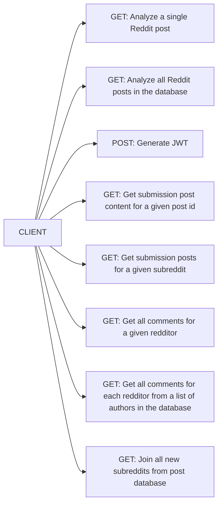

```mermaid
graph LR
    sub["/analyze_post"] --> sub1
    sub["/analyze_posts"] --> sub2
    sub["/login"] --> sub3
    sub["/get_sub_post"] --> sub4
    sub["/get_sub_posts"] --> sub5
    sub["/get_author_comments"] --> sub6
    sub["/get_authors_comments"] --> sub7
    sub["CLIENT"] --> sub8
    sub1["GET: Analyze a single Reddit post"]
    sub2["GET: Analyze all Reddit posts in the database"]
    sub3["POST: Generate JWT"]
    sub4["GET: Get submission post content for a given post id"]
    sub5["GET: Get submission posts for a given subreddit"]
    sub6["GET: Get all comments for a given redditor"]
    sub7["GET: Get all comments for each redditor from a list of authors in the database"]
    sub8["GET: Join all new subreddits from post database"]
```
