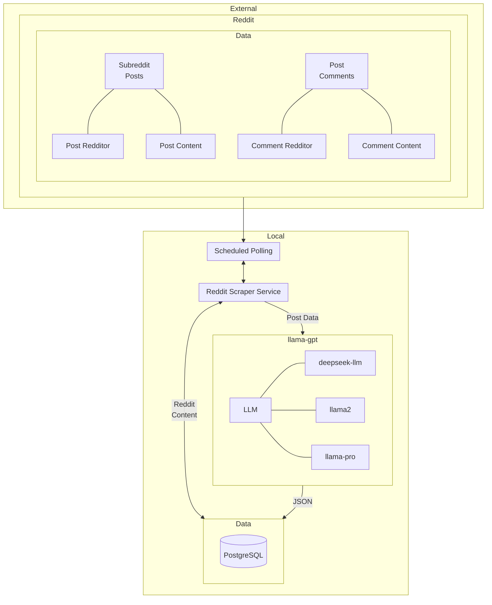

```mermaid
flowchart TD

subgraph External
subgraph Reddit
subgraph RData["Data"]
A[Subreddit
Posts]
B[Post
Comments]
C[Post Redditor]
D[Comment Redditor]
E[Post Content]
F[Comment Content]
A --- C
B --- D
A --- E
B --- F
end
end
end
subgraph Local
subgraph Client["Scheduled Polling"]
end
subgraph Service["Reddit Scraper Service"]
end
subgraph llama-gpt
llm[LLM]
llm1[deepseek-llm]
llm2[llama2]
llm3[llama-pro]
llm --- llm1
llm --- llm2
llm --- llm3
end
subgraph Data
db[(PostgreSQL)]
end
end
Reddit --> Client <--> Service <--Reddit 
Content--> Data
Service --Post Data--> llama-gpt
llama-gpt --JSON--> Data
```
